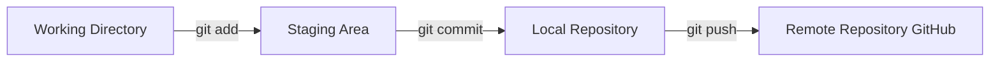

# Panduan Praktis Git & GitHub untuk Pemula

Panduan ini dirancang khusus untuk membantu Anda memahami konsep dasar **Git** (versi kontrol lokal) dan **GitHub** (platform kolaborasi cloud) serta cara menggunakannya dengan benar dalam proyek sehari-hari.

---

## 1. Perbedaan Git vs GitHub

Sering kali pemula menganggap Git dan GitHub adalah hal yang sama. Padahal, keduanya memiliki peran yang berbeda:

| Fitur | Git | GitHub |
| :--- | :--- | :--- |
| **Definisi** | Sistem Pengontrol Versi (*Version Control System*) berbasis lokal. | Platform berbasis cloud untuk menyimpan dan mengelola repositori Git online. |
| **Instalasi** | Diinstal di komputer lokal Anda (melalui CLI/Terminal). | Diakses via web browser (github.com). |
| **Fungsi Utama**| Mencatat riwayat perubahan file secara offline. | Berbagi kode, kolaborasi tim, review kode, dan backup cloud. |
| **Akses** | Milik pribadi di komputer Anda sendiri. | Dapat diakses oleh publik atau tim yang diberi izin. |

---

## 2. Alur Kerja Git (Git Lifecycle)

Ada 4 area utama dalam alur kerja Git yang harus Anda pahami:



1. **Working Directory (Lokal)**: Folder proyek tempat Anda mengedit kode secara langsung (status file: *Modified*).
2. **Staging Area**: Tempat penampungan sementara untuk memilih file mana saja yang akan disimpan dalam satu paket perubahan (status file: *Staged*). Perintahnya: `git add`.
3. **Local Repository**: Riwayat penyimpanan resmi yang tersimpan di memori Git komputer Anda (status file: *Committed*). Perintahnya: `git commit`.
4. **Remote Repository (GitHub)**: Repositori proyek online tempat berkolaborasi dengan tim. Perintahnya: `git push`.

---

## 3. Cara Melakukan Commit yang Baik

Pesan commit adalah catatan sejarah proyek Anda. Jika ditulis asal-asalan (contoh: `"update lagi"`, `"test"`, `"error"`), Anda akan kesulitan saat ingin mengembalikan kode ke versi sebelumnya jika terjadi bug.

### Standar Penulisan: Conventional Commits
Sangat disarankan menggunakan format awalan tipe perubahan seperti berikut:
*   `feat:` (Fitur baru) -> Contoh: `feat: tambah halaman form admin`
*   `fix:` (Perbaikan bug) -> Contoh: `fix: perbaiki crash loading menu`
*   `docs:` (Dokumentasi/README) -> Contoh: `docs: tambah panduan git`
*   `style:` (Kerapian kode/UI, tidak mengubah logika) -> Contoh: `style: rapikan margin logo`
*   `refactor:` (Restrukturisasi kode agar lebih bersih) -> Contoh: `refactor: optimasi DatabaseHelper`

> [!TIP]
> **Aturan Emas Commit**: 
> Lakukan commit sesering mungkin untuk perubahan kecil yang logis. Jangan menumpuk perubahan ratusan baris kode dalam satu commit tunggal.

---

## 4. Cheat Sheet: Perintah Git Terpenting

Berikut perintah yang akan paling sering Anda gunakan saat magang atau mengerjakan proyek:

### 🔹 Memulai Proyek
*   `git init` : Membuat repositori Git baru di folder lokal.
*   `git clone <url>` : Mengunduh proyek yang sudah ada dari GitHub ke komputer Anda.

### 🔹 Mengecek Status & Perubahan
*   `git status` : Melihat file mana saja yang diubah, dihapus, atau belum dipantau.
*   `git diff` : Melihat detail baris kode mana saja yang baru ditambahkan/dihapus.

### 🔹 Menyimpan Perubahan (Alur Utama)
*   `git add .` : Memasukkan semua file yang berubah ke Staging Area.
*   `git add nama_file.dart` : Hanya memasukkan file tertentu ke Staging Area.
*   `git commit -m "pesan"` : Mengunci perubahan dengan catatan riwayat.

### 🔹 Berinteraksi dengan GitHub
*   `git push origin <nama-branch>` : Mengirim commit lokal ke branch online di GitHub.
*   `git pull origin <nama-branch>` : Mengunduh dan menggabungkan update kode terbaru dari GitHub ke komputer lokal Anda.

### 🔹 Mengelola Cabang (Branching)
Branch digunakan agar Anda bisa mencoba fitur baru tanpa merusak kode utama (`main`).
*   `git branch` : Melihat daftar branch lokal.
*   `git checkout -b <nama-branch-baru>` : Membuat branch baru dan langsung berpindah ke sana.
*   `git checkout <nama-branch>` : Berpindah ke branch lain yang sudah ada.
*   `git merge <nama-branch>` : Menggabungkan perubahan dari branch lain ke branch aktif Anda saat ini.

---
## 5. Alur Kerja Mengupdate Branch Kedua (Bukan Utama)

Jika Anda memiliki branch kedua (misal namanya `branch-kedua` atau branch fitur Anda) dan ingin mengupdate branch tersebut dengan kode baru dari komputer lokal Anda, ikuti langkah-langkah praktis berikut:

### 🚀 A. Mengirim Perubahan ke Branch Kedua Anda (Push)
Gunakan alur ini untuk mengunggah pekerjaan harian Anda dari komputer lokal ke branch non-utama di GitHub:

1.  **Pindah ke branch kedua Anda** (jika belum berada di sana):
    ```bash
    git checkout nama-branch-kedua
    ```
    *(Ganti `nama-branch-kedua` dengan nama branch milik Anda).*

2.  **Periksa status file** yang diubah untuk memastikan tidak ada file sampah yang ikut ter-upload:
    ```bash
    git status
    ```

3.  **Tambahkan semua perubahan ke Staging Area**:
    ```bash
    git add .
    ```

4.  **Kunci perubahan dengan Commit**:
    ```bash
    git commit -m "feat: implementasi pencarian dinamis dan dropdown status pesanan"
    ```
    *(Sesuaikan pesan commit dengan apa yang baru saja Anda kerjakan).*

5.  **Push ke branch kedua Anda di GitHub**:
    ```bash
    git push origin nama-branch-kedua
    ```
    > [!IMPORTANT]
    > **PENTING**: Pastikan Anda menulis `origin nama-branch-kedua` dan **BUKAN** `origin main` agar tidak menimpa branch utama secara langsung!

---

### 🔄 B. Mensinkronkan Branch Kedua dengan Branch Utama (Pull / Merge)
Jika branch utama (`main`) mendapatkan update baru dari tim lain atau admin, dan Anda ingin branch kedua Anda tetap memiliki kode terbaru agar tidak tertinggal, ikuti langkah berikut:

1.  **Ambil update terbaru dari branch utama**:
    ```bash
    git checkout main
    git pull origin main
    ```

2.  **Pindah kembali ke branch kedua Anda**:
    ```bash
    git checkout nama-branch-kedua
    ```

3.  **Gabungkan (Merge) perubahan dari branch `main` ke branch kedua Anda**:
    ```bash
    git merge main
    ```
    Jika ada konflik (*conflict*), Git akan memberi tahu file mana saja yang bentrok. Buka file tersebut di VS Code, pilih kode yang ingin dipertahankan (Accept Current / Accept Incoming), lalu commit kembali:
    ```bash
    git add .
    git commit -m "merge: gabungkan update terbaru dari main"
    git push origin nama-branch-kedua
    ```

---

## 6. Tips Tambahan: Mengecek Posisi Branch Anda
Sebelum melakukan perintah push/commit, selalu biasakan untuk menjalankan:
```bash
git branch
```
Branch yang aktif akan ditandai dengan tanda bintang (`*`) dan berwarna hijau. Pastikan tanda bintang berada di branch kedua Anda sebelum melakukan `git push origin nama-branch-kedua`.
