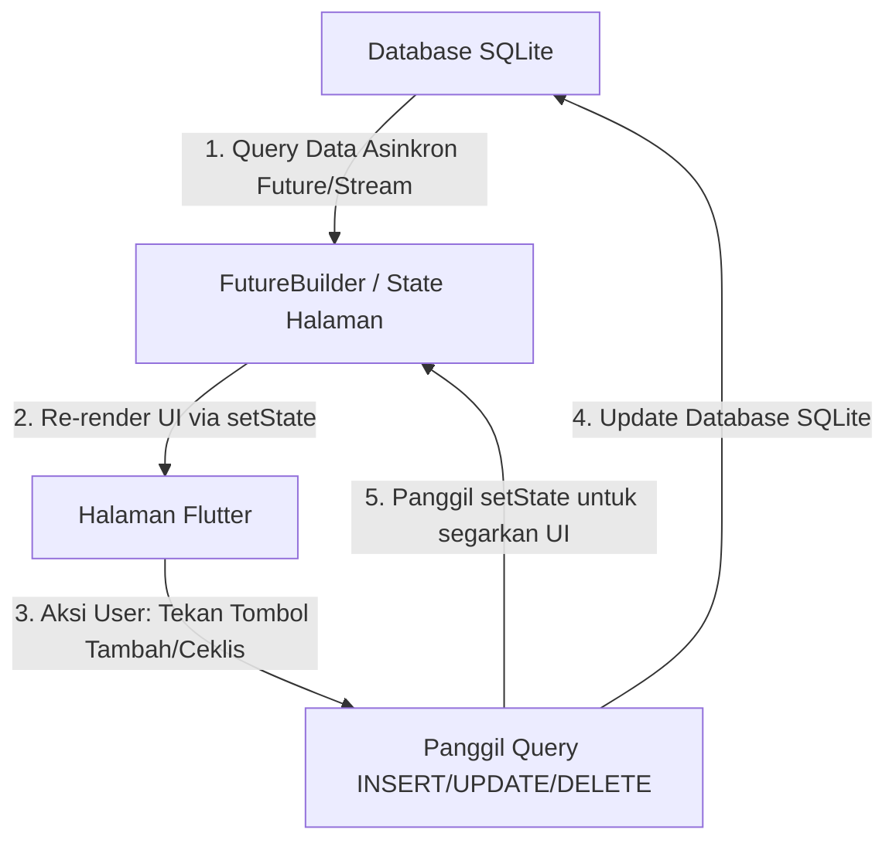

# PANDUAN MASTER LIVE CODING - FOODIE APP
Panduan ini dirancang khusus untuk membantu Anda menghadapi sesi Live Coding selama 30 menit bersama mentor. Semua penjelasan dibuat sederhana, rinci, dan fokus pada konsep dasar Flutter, alur data (state), database SQLite, serta logika widget.

---

## 1. STRUKTUR FOLDER & ARSITEKTUR APLIKASI
Aplikasi Foodie menggunakan arsitektur modular yang memisahkan antara UI (Halaman & Widget), Logika Data (Model), dan Layanan (Database & Navigasi).

*   **`lib/main.dart`**: Entry point (titik awal) aplikasi. Mengatur konfigurasi dasar seperti inisialisasi SQLite, tema aplikasi, dan halaman pertama yang dijalankan (Splash/AuthPage).
*   **`lib/constants/`**: Menyimpan variabel global/konstanta agar desain konsisten.
    *   `app_colors.dart`: Kode warna Figma (seperti `primary` orange, `textPrimary` hitam kecokelatan, dll).
    *   `app_dimensions.dart`: Jarak padding dan radius standar.
*   **`lib/models/`**: Representasi struktur data (cetak biru objek).
    *   `food_item.dart`: Struktur data menu makanan (`id`, `name`, `price`, `imagePath`, dll).
    *   `order_history_item.dart`: Struktur data transaksi pesanan (`id`, `food`, `quantity`, `statusLabel`, `total`, dll).
*   **`lib/services/`**: Pengelola logika di balik layar.
    *   `database_helper.dart`: Pengelola SQLite (koneksi, migrasi tabel, insert/delete/update data).
    *   `app_navigation.dart`: Pengatur perpindahan halaman secara terpusat.
*   **`lib/widgets/`**: Komponen UI kecil yang bisa digunakan berulang kali (*reusable*), seperti `ReusableImage` (menampilkan gambar asset/network/base64), `ReusableButton`, dan kartu-kartu belanja.
*   **`lib/pages/`**: Halaman utama aplikasi (seperti `HomePage`, `CartPage`, `OrderDetailPage`, `AuthPage`, dll).

---

## 2. KONSEP DASAR FLUTTER & FUNGSI WIDGET
Mentor Anda kemungkinan besar akan menanyakan dasar-dasar Flutter. Berikut penjelasan yang wajib Anda pahami:

### A. StatelessWidget vs StatefulWidget
*   **`StatelessWidget`**: Widget statis yang **tidak dapat berubah** setelah digambar di layar. Datanya dikirim saat inisialisasi dan tidak akan berubah selama widget itu hidup. Contoh: `OrderDetailPage`, `FoodCheckoutCard`.
*   **`StatefulWidget`**: Widget dinamis yang **bisa berubah status (state) datanya** secara real-time saat aplikasi berjalan. Widget ini memiliki objek `State` pendamping dan metode `setState()`. Contoh: `CartPage` (karena jumlah item, ceklis, dan total harga bisa berubah saat ditekan).

### B. Siklus Hidup (Lifecycle) StatefulWidget
Jika ditanya alur hidup widget dinamis:
1.  **`createState()`**: Flutter membuat objek `State` untuk melacak data widget.
2.  **`initState()`**: Dijalankan **hanya sekali** saat widget pertama kali dimasukkan ke layar. Sangat cocok untuk inisialisasi data awal, controller, atau memuat data dari database.
3.  **`build()`**: Dijalankan berulang kali setiap kali widget digambar ke layar atau saat `setState()` dipanggil.
4.  **`dispose()`**: Dijalankan **sekali** saat widget dihapus dari memori/layar. Digunakan untuk membersihkan memory leak (misal menutup controller `TextEditingController.dispose()`).

### C. Widget Utama & Kegunaannya
*   **`Scaffold`**: Widget struktural dasar yang menyediakan kerangka layout halaman visual standar Android/iOS (menyediakan tempat untuk `appBar`, `body`, `bottomNavigationBar`, dll).
*   **`SafeArea`**: Menghindari notch (poni), kamera bulat di layar, serta bilah navigasi bawah sistem HP agar konten tidak terpotong.
*   **`Stack` & `Positioned`**: `Stack` menumpuk widget satu sama lain dari belakang ke depan (z-axis). `Positioned` digunakan untuk menempatkan anak dari `Stack` di posisi koordinat koordinat absolut tertentu (`top`, `left`, `right`, `bottom`). Ini yang kita pakai untuk tombol **Back melayang** agar tidak ikut ter-scroll.
*   **`Column` vs `Row`**: `Column` menyusun widget secara vertikal (atas ke bawah), `Row` menyusun secara horizontal (kiri ke kanan).
*   **`SingleChildScrollView`**: Mengaktifkan fitur gulir (scroll) pada satu widget anak jika kontennya melebihi tinggi layar, sehingga mencegah error **yellow-black striped overflow bar**.
*   **`ListView.separated`**: Menampilkan daftar item dalam bentuk list gulir dengan efisien (hanya merender item yang terlihat di layar) serta memberikan pemisah (separator) otomatis antar-item.

---

## 3. ALUR DATA & STATE MANAGEMENT (DATA FLOW)
Anda harus bisa menjelaskan bagaimana data mengalir dari database hingga tampil di layar:



### Penjelasan Detik-Demi-Detik di CartPage:
1.  **Memuat Data (`initState`)**: Saat `CartPage` dibuka, program memanggil `_loadCart()` yang asinkron (`Future`) untuk meminta data keranjang dari `DatabaseHelper.instance.getCart()`.
2.  **Menyimpan ke State**: Hasil dari database dimasukkan ke dalam variabel `cartItems` dan memanggil `setState()` agar halaman digambar ulang menampilkan daftar makanan.
3.  **Aksi Pengguna (Contoh: Menambah Jumlah Qty)**:
    *   User menekan tombol `+` pada produk.
    *   Metode `_updateQty(cartId, newQty)` dipanggil.
    *   Metode ini menjalankan query `DatabaseHelper.instance.updateCartQty(cartId, newQty)` secara asinkron.
    *   Setelah database terupdate, metode memanggil kembali `_loadCart()` untuk mengambil data terbaru dan memanggil `setState()` untuk memperbarui tampilan jumlah item dan total harga di layar secara instan.

---

## 4. DATABASE SQLITE (`DatabaseHelper`)
SQLite adalah database lokal relasional yang digunakan aplikasi untuk menyimpan data secara permanen di memori HP.

### Metode CRUD Utama di `DatabaseHelper`:
*   **Create (Tambah Data)**: Menggunakan `db.insert(namaTabel, mapData)`.
    *   Contoh: `insertToCart(Map<String, dynamic> item)` menyimpan item makanan pilihan ke tabel `tb_cart`.
*   **Read (Ambil Data)**: Menggunakan `db.query(namaTabel)` or `db.rawQuery(querySQL)`.
    *   Contoh: Di `OrderDetailPage` atau `HistoryPage`, kita menggunakan SQL JOIN untuk menggabungkan data pesanan dengan data profil menu makanan:
        ```sql
        SELECT tb_pesanan.*, tb_menu.name AS m_name, tb_menu.price AS m_price ... 
        FROM tb_pesanan 
        INNER JOIN tb_menu ON tb_pesanan.menu_id = tb_menu.id
        ```
*   **Update (Ubah Data)**: Menggunakan `db.update(namaTabel, mapData, where: 'id = ?', whereArgs: [id])`.
    *   Contoh: `updateCartQty` mengubah jumlah porsi makanan di keranjang belanja.
*   **Delete (Hapus Data)**: Menggunakan `db.delete(namaTabel, where: 'id = ?', whereArgs: [id])`.
    *   Contoh: `removeFromCart` menghapus makanan dari keranjang.

---

## 5. KUNCI JAWABAN: 5 PERTANYAAN TEKNIS POPULER DARI MENTOR

### Pertanyaan 1: "Mengapa kita menggunakan FutureBuilder untuk menampilkan data dari database, dan apa bedanya dengan memuat data biasa?"
> **Jawaban:** 
> Membaca data dari database membutuhkan waktu (asinkron) karena sistem harus membaca memori fisik HP. Jika kita menggunakan pemanggilan sinkron biasa, aplikasi akan membeku (freeze) sampai data selesai dibaca. 
> `FutureBuilder` digunakan untuk menangani proses asinkron ini secara otomatis. Ia memantau status `Future` dan menyediakan `AsyncSnapshot` (apakah data masih loading, error, atau sudah selesai) sehingga kita bisa menampilkan loading indicator (`CircularProgressIndicator`) terlebih dahulu sebelum merender data aslinya.

### Pertanyaan 2: "Apa kegunaan dari kata kunci `async` dan `await` di Dart?"
> **Jawaban:**
> `async` menandai sebuah fungsi bahwa di dalamnya terdapat proses asinkron yang akan mengembalikan objek `Future`.
> `await` digunakan untuk menghentikan sementara eksekusi baris kode berikutnya sampai proses asinkron tersebut selesai mengembalikan nilai. Ini membuat kode asinkron kita terlihat dan mudah dibaca seperti kode sinkron berurutan (tidak perlu menggunakan callback `.then()`).

### Pertanyaan 3: "Bagaimana cara kerja navigasi menggunakan `Navigator.push` dan `Navigator.pop`?"
> **Jawaban:**
> Navigasi Flutter menggunakan konsep **Stack (tumpukan)**. 
> *   `Navigator.push` memasukkan halaman baru ke atas tumpukan layar (layar baru menutupi layar lama).
> *   `Navigator.pop` menghapus layar paling atas dari tumpukan, sehingga layar di bawahnya aktif kembali (kembali ke halaman sebelumnya).

### Pertanyaan 4: "Apa fungsi dari `shrinkWrap: true` dan `physics: NeverScrollableScrollPhysics()` pada ListView di halaman CartPage?"
> **Jawaban:**
> Karena `ListView` berada di dalam `SingleChildScrollView` (yang sama-sama memiliki fitur scroll), jika kita tidak membatasi `ListView`, ia akan mencoba mengambil tinggi tak terbatas dan menyebabkan bentrokan scroll (error/macet).
> *   `shrinkWrap: true` memaksa `ListView` hanya mengambil tinggi sebesar total elemen anaknya saja (tidak mengambil tinggi maksimal layar).
> *   `NeverScrollableScrollPhysics()` mematikan fitur scroll mandiri dari `ListView` agar proses scroll ditangani sepenuhnya oleh `SingleChildScrollView` induknya.

### Pertanyaan 5: "Bagaimana cara kerja perbaikan flicker/kedipan gambar Base64 yang baru saja diimplementasikan?"
> **Jawaban:**
> Sebelumnya, setiap kali `setState` dipanggil, string Base64 dikonversi ulang menjadi byte array baru di memori. Flutter mendeteksi alamat memori yang berbeda sebagai gambar baru sehingga memicu kedipan saat loading ulang.
> Solusinya adalah dengan membuat **Cache Map statis** untuk menyimpan byte hasil decode pertama kali berdasarkan string path-nya. Rebuild berikutnya langsung mengambil byte yang sama dari cache. Ditambah dengan properti `gaplessPlayback: true` pada widget `Image`, gambar lama tetap ditahan di layar saat gambar baru dimuat sehingga kedipan hilang sepenuhnya.

---

## 6. SIMULASI TUGAS LIVE CODING (CRITICAL TASKS)
Biasanya mentor akan meminta Anda melakukan perubahan kecil pada fitur CRUD/transaksi secara langsung. Berikut 3 contoh tugas dan cara mengerjakannya:

### Kasus A: Mentor meminta "Tambahkan tombol hapus (Delete) di setiap kartu item Cart"
1.  **Buka file `lib/pages/cart_page.dart`**.
2.  Di dalam `itemBuilder` untuk `ListView.separated`, cari widget `Row` yang membungkus `Checkbox` dan `FoodCheckoutCard`.
3.  Anda tinggal menambahkan ikon tempat sampah di dalam Row tersebut:
    ```dart
    IconButton(
      icon: const Icon(Icons.delete_outline, color: Colors.red),
      onPressed: () async {
        // Panggil database helper untuk menghapus item
        await DatabaseHelper.instance.removeFromCart(cartId);
        // Refresh data di layar
        _loadCart();
      },
    )
    ```

### Kasus B: Mentor meminta "Ubah status transaksi pesanan di Order History / Detail Pesanan langsung dari aplikasi"
1.  **Buka `lib/services/database_helper.dart`** dan pastikan metode update status sudah ada (biasanya `updateStatusPesanan(orderId, newStatus)`).
2.  **Buka `lib/pages/order_detail_page.dart`**.
3.  Di tombol terbawah (misalnya saat tombol bayar ditekan), jalankan query update ke SQLite:
    ```dart
    await DatabaseHelper.instance.updateStatusPesanan(order.id, 'Berhasil');
    // Beri tahu user dan kembali ke halaman sebelumnya
    ScaffoldMessenger.of(context).showSnackBar(
      const SnackBar(content: Text('Pesanan berhasil dibayar!'))
    );
    AppNavigation.back(context);
    ```

### Kasus C: Mentor meminta "Tampilkan dialog konfirmasi saat menekan tombol Pesan Sekarang"
1.  **Buka `lib/pages/cart_page.dart`**.
2.  Cari properti `onPressed` pada `ReusableButton` ("Pesan Sekarang!").
3.  Bungkus logika pemesanan dengan fungsi dialog konfirmasi bawaan Flutter (`showDialog`):
    ```dart
    onPressed: selectedCartItemIds.isEmpty
        ? null
        : () {
            showDialog(
              context: context,
              builder: (dialogCtx) => AlertDialog(
                title: const Text('Konfirmasi Pesanan'),
                content: const Text('Apakah Anda yakin ingin memesan makanan ini?'),
                actions: [
                  TextButton(
                    onPressed: () => Navigator.pop(dialogCtx),
                    child: const Text('Batal'),
                  ),
                  TextButton(
                    onPressed: () async {
                      Navigator.pop(dialogCtx); // Tutup dialog
                      // Jalankan logika transaksi pemesanan asli di sini...
                    },
                    child: const Text('Ya, Pesan'),
                  ),
                ],
              ),
            );
          }
    ```
